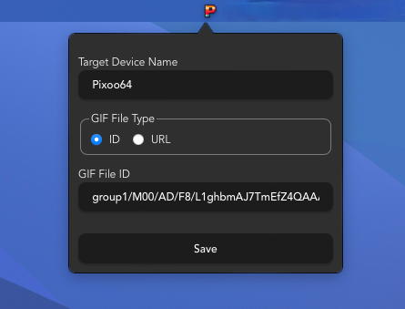

# Pixoonair

Pixoonair is a menubar app that displays GIFs on your Pixoo64 device, triggered by webcam activity. When your webcam is active, the app automatically displays a predefined "On Air" GIF. When the webcam is off, it switches back to a normal display.

## Features

- **Mac Menubar App**: Accessible directly from your Mac's menubar.
- **Pixoo64 Support**: Allows you to connect and send updates to your Divoom Pixoo64 device.
- **Webcam Trigger**: Automatically reacts to the status of your webcam (on/off).
- **Customizable Settings**: Set the GIF to display and target Pixoo64 device.

## Download

Download the latest version from the [GitHub releases page](https://github.com/moqada/Pixoonair/releases).

## Usage



1. Launch Pixoonair and locate the menubar icon.
2. Click the icon to open the settings.
3. Configure:
   - **Device Name**: The name of your Pixoo64 device.
   - **GIF File Type**: Specify how the "On Air" GIF is selected (e.g., ID or URL).
   - **GIF File ID/URL**: Provide the identifier or URL for the GIF to display when your webcam is active.
4. The app automatically detects your webcam's activity and updates the Pixoo64 display accordingly.
5. To exit the app, right-click the menubar icon and select **Quit**.

## Configuration Details

- **Device Name**: The name of your Pixoo64 device to connect.
- **GIF File Type**: Select how the GIF is specified (by ID or URL).
- **GIF File ID**: The identifier of the GIF to display.
- **GIF File URL**: The URL of the GIF file for your "On Air" status.

Settings are saved automatically and persist across app restarts.

## Development

Refer to the [Tauri Development Guide](https://v2.tauri.app/start/prerequisites/) for prerequisites and setup instructions.

### Running the App

Install dependencies and run the app in development mode:

```bash
pnpm install
pnpm tauri dev
```

### Building the App

To create a distributable `.dmg` file:

```bash
pnpm tauri build --bundles dmg
```

## Note

Pixoonair is designed exclusively for **macOS** and is not compatible with other operating systems.

## License

This project is licensed under the [MIT License](LICENSE).
